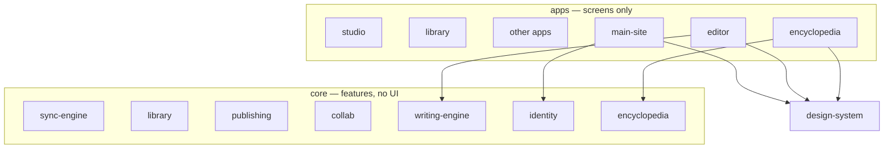

# Architecture

Assume every current file is bad. Login, appearance, and engines will be remade. This document is the contract for where new code goes.

## Three folders (they expand)

Drawn like the map: screens on top, look in the middle, feature code underneath. Open **design-system** first.

1. **design-system/** — how it looks. Settings *picks* a theme; every other app *applies* it. Never imports `core/`.
2. **apps/** — screens. HTML plus thin glue. Import design-system for look and core for behavior. Never import other apps. Main-site is isolated (landing, login, settings, legal).
3. **core/** — what the product is. No HTML, CSS, or `document`. Never imports `design-system/` or `apps/`.

## Skin contract

Every app page (except the marketing homepage, which skips gradient theme on purpose) loads, in order:

1. `/design-system/css/theme.css`
2. `/design-system/css/gradient-themes.css`
3. `/design-system/css/typography.css`
4. `/design-system/appearance/boot.js` (no defer)

## Data flow (today, legacy)

Auth → `core/identity` → cloud (Supabase) or local guest (`core/sync-engine/local-adapter.js`, still localStorage).

Manuscript snapshots live in `core/writing-engine/version-api.js` (still mixed with storage). Rewrite pass: writing-engine becomes storage-free; adapters own I/O.

Encyclopedia lore blobs: `core/encyclopedia/blob-store.js`. Not chapter prose.

Scheduled chapter releases currently can be triggered from the homepage. That belongs in `core/server/jobs/` and will move when jobs are implemented.

## Hosting

Deploy root is the git root so `/core/` and `/design-system/` are real URLs. Vercel rewrites HTML, `/js/*`, `/css/*`, and PWA files from `apps/main-site/`. Do not catch-all rewrite to `index.html` — that would swallow engine files.

Local preview: `python3 core/server/dev.py` (not `serve .`).

`middleware.js` stays at the git root because Vercel only loads it there.

One PWA at the site origin (`apps/main-site/public/sw.js`).

## Secrets

- Anon / publishable key: browser, `core/identity/client.js` (legacy hardcoded; remake later).
- Service role: host env / local `.env` only. Template: `host/env.example`. Never in apps, design-system, or browser modules.
