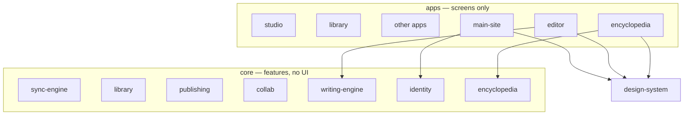

# Repository structure

Three folders. They expand. Everything else (backend, docs, host config) supports them.



Read this top to bottom, the same way the diagram is drawn: screens on top, the look in the middle, feature code underneath.

---

## 1. `design-system/` — the look (open this first)

The one UI. Colors, the many gradient themes, fonts, page backgrounds, display type.

Every current and future app boots this. Features never pick their own colors. This folder never imports `core/`.

```
design-system/
  docs/           map — STRUCTURE, CONVENTIONS, ARCHITECTURE, DOMAIN
  tokens/
  css/            theme.css, gradient-themes.css, typography.css
  appearance/     boot.js and the theme runtime
  fonts/
  components/     later — shared chrome
```

**Skin contract** (every app page except the marketing homepage, which skips gradient theme on purpose):

1. `/design-system/css/theme.css`
2. `/design-system/css/gradient-themes.css`
3. `/design-system/css/typography.css`
4. `/design-system/appearance/boot.js` (no defer)

Settings on main-site is the **picker**. Every other app only **applies** what was saved.

---

## 2. `apps/` — screens only

HTML plus thin glue. They import `design-system/` for look and `core/` for behavior. Apps never import other apps.

```
apps/
  main-site/        live — landing, login, signup, settings, legal
  studio/           later — writer hub
  editor/           later — offline writing
  library/          later — browse / read / authors
  encyclopedia/     later — World Encyclopedia UI
  collab-rooms/     later
  plot-studio/      reserved Vite app
  community/        later
  admin/            later
  analysis/         later
  archive/          retired screens — live code never imports this
```

`main-site/` is isolated. It is not the house. Layout: `pages/`, `ui/`, `css/`, `assets/`, `public/`.

Public URLs did not change (`/login.html`, `/settings.html`).

---

## 3. `core/` — features, no UI

What the product *is*. No HTML, CSS, or `document`. Never imports `design-system/` or `apps/`.

```
core/
  writing-engine/     manuscript: chapters, versions, word count
  sync-engine/        local-adapter now; realtime + conflict later
  identity/           auth, session, account types
  library/            public catalog, author profiles
  publishing/         serialization, scheduled releases
  encyclopedia/       story bible blobs — not chapter prose
  collab/             beta rooms now; live rooms later
  community/          later
  analysis/           later
  notifications/      later
  tests/              engine tests later
  server/             HTTP, jobs, SQL — browsers never load this
```

Same name under `apps/` and `core/` means screen vs data (example: `apps/encyclopedia/` is the shelf UI, `core/encyclopedia/` is the blob store).

---

## File tree at the repo root

You should see **three product folders**, then `host/` for deploy contracts:

```
apps/
core/
design-system/
host/
```

`api/` is not a product folder. Vercel will only run functions from a root `api/` directory; it re-exports `core/server/api/`.

Git, Vercel, and Firebase also require a few **non-secret** files at the git root (they will not look inside `host/`): `.gitignore`, `.gitattributes`, `vercel.json`, `firebase.json`, `.firebaserc`, and a one-line `middleware.js` that re-exports `host/middleware.js`. See [host/README.md](../../host/README.md).

Local preview: `python3 core/server/dev.py`

See [CONVENTIONS.md](CONVENTIONS.md), [ARCHITECTURE.md](ARCHITECTURE.md), [DOMAIN.md](DOMAIN.md).
