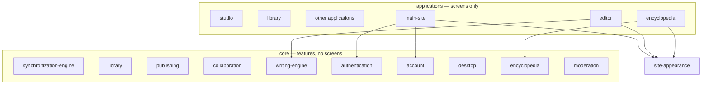

# Architecture

Assume every current file is bad. Login, appearance, and engines will be remade. This document is the contract for where new code goes.

## Three folders (they expand)

Drawn like the map: screens on top, look in the middle, feature code underneath. Open **site-appearance** first.

1. **site-appearance/** — how it looks. Same name as Settings → Appearance. Settings *picks* a theme; every other application *applies* it. Never imports `core/`.
2. **applications/** — screens. HTML plus thin glue. Import site-appearance for look and core for behavior. Never import other applications. Main-site is isolated (landing, login, settings, legal). Staff tools are not applications.
3. **core/** — what the product is. No HTML, CSS, or `document`. Never imports `site-appearance/` or `applications/`.

## Skin contract

Every application page (except the marketing homepage, which skips gradient theme on purpose) loads, in order:

1. `/site-appearance/css-styles/theme.css`
2. `/site-appearance/css-styles/gradient-themes.css`
3. `/site-appearance/css-styles/typography.css`
4. `/site-appearance/boot.js` (no defer)

## Data flow (today, legacy)

Sign-in → `core/authentication` → cloud (Supabase) or local guest (`core/desktop` + `core/synchronization-engine/local-adapter.js`, still localStorage). Who the user is lives in `core/account`.

Manuscript snapshots live in `core/writing-engine/version-api.js` (still mixed with storage). Rewrite pass: writing-engine becomes storage-free; adapters own I/O.

Encyclopedia lore blobs: `core/encyclopedia/blob-store.js`. Not chapter prose.

Scheduled chapter releases currently can be triggered from the homepage. That belongs in `core/server/jobs/` and will move when jobs are implemented.

Staff / reports later: `core/moderation`. Not an application.

## Hosting

Deploy root is the git root so `/core/` and `/site-appearance/` are real URLs. Vercel rewrites HTML, `/js/*`, `/css/*`, and PWA files from `applications/main-site/`. Do not catch-all rewrite to `index.html` — that would swallow engine files.

Local preview: `python3 core/server/dev.py` (not `serve .`).

`middleware.js` stays at the git root because Vercel only loads it there.

One PWA at the site origin (`applications/main-site/public/sw.js`).

## Secrets

- Anon / publishable key: browser, `core/authentication/client.js` (legacy hardcoded; remake later).
- Service role: hosting env / local `.env` only. Template: `hosting/env.example`. Never in applications, site-appearance, or browser modules.
