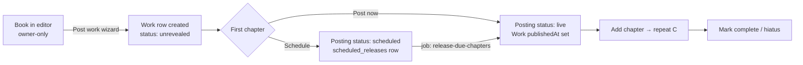

# Publishing (draft)

How a manuscript in the editor becomes a public, serialized work that readers
can find, follow, and read — modeled on **Archive of Our Own**
(`archiveofourown.org`) and adapted to Alysum's three-folder architecture.

Status: **design draft.** Nothing here is built yet. The current `library`
table (one JSON `data` blob per work) is the legacy shape this replaces. Read
[ARCHITECTURE.md](ARCHITECTURE.md), [STRUCTURE.md](STRUCTURE.md),
[DOMAIN.md](DOMAIN.md), and [CONVENTIONS.md](CONVENTIONS.md) first.

---

## 1. What we take from AO3, and what we don't

| Take | Adapt | Skip (for now) |
| --- | --- | --- |
| Rating + Archive Warnings + Category chosen at post time, shown on every card | Fandom / Character / Relationship / Freeform tags as first-class rows | Full tag wrangling (canonical tags, synonyms, meta-tags) — start flat, wrangle later |
| Chapter-by-chapter posting with per-chapter start/end notes | Series (ordered multi-work) | Challenges / prompt memes / anon collections |
| Kudos (one per user per work, guests allowed once) | Collections (curated groups, open or moderated) | Skins / custom work CSS |
| Bookmarks (private/public, with reader notes and bookmark-tags) | Subscriptions (to a work, a series, or an author) | Orphaning to a shared "orphan_account" |
| Hit counts, word counts, chapter counts (`3/12`, `3/?`) | Co-creators and "gift" attribution | Comment threading beyond one level (we already cap at one) |
| Download EPUB / PDF / HTML / plain text | "Registered users only" and "hide from search engines" toggles | AZW3/MOBI (Kindle now takes EPUB) |
| Filter/sort sidebar (by tag, rating, warning, word count, status, date) | Mystery / reveal collections → **defer** | Tag-search RSS/Atom feeds (nice later) |

The north star: **an author posts a work once, then adds chapters over
weeks; readers filter a catalog, subscribe, get notified on each drop, leave
kudos and comments, and can download the whole thing.**

---

## 2. Layering — where the code goes

Publishing is genuinely cross-cutting. The wall rules from ARCHITECTURE.md
still hold: `core/` has no DOM, `applications/` never import each other,
`site-appearance/` never imports `core/`.

```
applications/
  studio/          author-side: the "Post / manage work" screens
                   (publish wizard, chapter manager, schedule, stats)
  library/         reader-side: catalog + filter sidebar, work landing page,
                   chapter reader, series pages, collection pages,
                   author works page, bookmark UI
  main-site/       Settings → subscriptions list, blocked tags, download prefs
                   (picker only — no publishing surface of its own)

site-appearance/
  components/      later: shared work-card, tag-pill, rating-badge chrome

core/
  publishing/      the posting pipeline + all shared logic (see §7)
  library/         public catalog + author-profile queries (data form of the
                   reader lane) — extends today's author-profile.js
  notifications/   follows, replies, chapter-drop alerts (currently a stub)
  server/
    http-handlers/ POST post-work, POST post-chapter, GET download/:workId.:fmt
    jobs/          release-due-chapters, send-subscription-digests,
                   build-download-artifacts, recount-hits
```

`api/` at the root re-exports the `core/server/http-handlers/` entries; no
logic there.

---

## 3. Domain shapes (extends DOMAIN.md)

`Book` / `Chapter` / `Version` are unchanged — that is the **manuscript**,
owner-only, edited in `applications/editor/`. Publishing adds a public layer
on top. Everything below is camelCase as seen outside `core/`'s data layer;
Supabase stores snake_case.

### Work

The public listing for a `Book`. One row per posted book. Replaces the
`library.data` blob.

- `id` — uuid
- `bookId` — the source manuscript (`books.id`); nullable if the manuscript is later deleted but the work is kept
- `userId` — primary creator
- `title`, `summary` (rich text, capped), `notesBefore`, `notesAfter` (work-level)
- `language` — BCP-47, default `en`
- `mediaFormat` — mirrors the book: `novel | screenplay | manga | comic | manhwa`
- `rating` — `not-rated | general | teen | mature | explicit`
- `archiveWarnings` — array of `none | choose-not-to-warn | graphic-violence | major-death | noncon | underage` (multi-select; `none` and `choose-not-to-warn` are exclusive)
- `categories` — array of `gen | f-m | f-f | m-m | multi | other`
- `serializationStatus` — `in_progress | complete | hiatus | abandoned` (extends today's two values)
- `plannedChapterCount` — int or null (the `?` in `3/?`)
- `isRestricted` — registered users only
- `hideFromSearchEngines` — emit `noindex`
- `isAnonymous` — hide creator on the public page
- `allowComments` — `everyone | registered | none`
- `allowKudos` — bool
- `moderateComments` — bool (author approves before public)
- `publishedAt`, `updatedAt` (last chapter drop), `createdAt`
- Denormalized counters (updated by triggers/jobs): `wordCount`, `chapterCount`, `publishedChapterCount`, `hitCount`, `kudosCount`, `commentCount`, `bookmarkCount`, `subscriberCount`

### Posting

A published chapter — the public projection of a `Chapter`. The manuscript
keeps front/body/back sections; a Posting is always a body chapter that the
author has released (or scheduled).

- `id` — uuid
- `workId`, `chapterId` (source `ch_…`)
- `position` — 1-based public order (may differ from manuscript order if the author reorders)
- `title`, `contentHtml` (sanitized snapshot at post time), `contentHash`
- `notesBefore`, `notesAfter`
- `wordCount`
- `status` — `live | scheduled | draft`
- `publishedAt` — null until live
- `scheduledReleases` continues to drive `scheduled → live` (see §6)

Comic/manhwa postings carry `imageUrls` instead of `contentHtml`, same as the
manuscript chapter.

### Tag

Flat to start. One row per distinct `(type, name)`.

- `id` — uuid
- `type` — `fandom | character | relationship | freeform | warning | rating | category`
- `name` — display form; `canonicalName` nullable (points at the wrangled tag later)
- `slug` — url-safe
- `usageCount` — denormalized

`work_tags (work_id, tag_id, position)` is the join. Warnings/rating/category
are *also* stored as enum columns on `Work` for fast filtering; the tag rows
exist so the filter sidebar and tag pages are uniform.

### Series

- `id`, `userId`, `title`, `summary`, `notes`, `serializationStatus`, `isComplete`
- `series_works (series_id, work_id, position)`

### Collection

- `id`, `ownerUserId`, `title`, `slug`, `summary`
- `isOpen` (anyone can add) vs `isModerated` (owner approves), `isClosed`
- `isRevealed` (mystery collections — hide works until a reveal date), `revealAt`
- `collection_items (collection_id, work_id, status: pending|approved|rejected)`
- `collection_maintainers (collection_id, user_id)`

### Bookmark

- `id`, `userId`, `workId` (or `seriesId`), `notes` (rich text), `isPrivate`, `isRec`
- `bookmark_tags` — reader's own freeform tags, not shared with the work
- `createdAt`

### Subscription

- `id`, `userId`, `targetType` (`work | series | user | collection`), `targetId`, `createdAt`
- Drives the chapter-drop digest job.

### Kudos

- `(work_id, user_id)` unique for members; `(work_id, guest_hash)` for guests (hashed IP+UA, one-way, salted, rotated) — mirrors AO3's guest-kudos rule.

### Comment

Already exists (`comments`, per-chapter, one level of threading via
`parent_id`). Add: `posting_id` FK, `status` (`live | pending | spam | deleted`),
`guestName` / `guestEmail` for logged-out commenters when the work allows it.

### Not this domain

Plot-studio cards, notebook vault, Word Wars — untouched. Author tip/support
links already live in `core/library/author-profile.js` and are shown on work
pages as-is.

---

## 4. The posting pipeline



### Post-work wizard (`applications/studio/`)

One screen, AO3's "New Work" form adapted:

1. **Which manuscript** — pick a `Book` the user owns. Pre-fills title, word count, media format, chapter list.
2. **Required tags** — rating (single), archive warnings (multi, default "Choose not to warn"), categories (multi). Cannot post without a rating and at least one warning choice.
3. **Fandom / character / relationship / freeform** — free-text with autocomplete against existing `Tag` rows; new names create new flat tags.
4. **Summary + work notes** (before/after), language.
5. **Chapters to include** — checkboxes over body chapters; default all. Each can be *post now* or *schedule for <datetime-local>* (reuses `core/publishing/scheduled-releases.js` timezone handling verbatim).
6. **Visibility** — registered-users-only, anonymous, hide from search engines, comment policy, allow kudos, moderate comments.
7. **Series / collections** — optional: add to an existing series or create one; submit to collections.

On submit → `POST /api/post-work` → `core/server/http-handlers/post-work.js`:
creates the `Work`, `Tag`/`work_tags` rows, `Posting` rows (live or scheduled),
`scheduled_releases` rows, series/collection links; sets
`users.last_new_book_published_at` for the 30-day cooldown; fans out
subscription notifications for author-followers.

### Existing publish gates stay

`supabase-publish-cooldown.sql` already enforces: 7-day account age before any
publish, 30-day gap between *new* works, staff bypass tickets. Keep it. The
wizard calls the existing `publish_can_create_new_listing` RPC before showing
step 1 and links to the approval-request flow if blocked.

### Adding a chapter later

`applications/studio/` chapter manager → select a body chapter that has no
`Posting` yet → post now or schedule. `POST /api/post-chapter`. Updates
`Work.publishedChapterCount`, `updatedAt`; fans out the chapter-drop digest.

### Editing after posting

Editing prose happens in the editor (the manuscript). A **"push update to
posting"** action re-snapshots `contentHtml`/`contentHash` for that posting.
Silent by default; optional "notify subscribers of a major revision" checkbox.
Never auto-syncs — the public snapshot only changes when the author says so.

### Un-posting

`status: draft` on a posting hides one chapter; unpublishing the work sets
`Work` to `unrevealed` and 404s the public page but keeps rows, comments, and
kudos so a re-post is lossless. Hard delete goes through the account-deletion
path only.

---

## 5. Reader lane (`applications/library/`)

### Catalog + filter sidebar

The Royal-Road/AO3 hybrid the `applications/library/README.md` already
promises. Server-side filtered query against a `library_catalog` view (the
name today's `core/library/author-profile.js` already probes for):

- Filter: included/excluded tags, rating, warnings, categories, language, word-count range, chapter-count range, completion status, "updated in last N days", crossovers on/off, hide works with X warning.
- Sort: date updated, date posted, kudos, hits, comments, bookmarks, word count, title.
- Facet counts next to each filter value (AO3-style), computed from the same view.

### Work landing page

Header block (title, creators or "Anonymous", fandoms), the tag set as
clickable pills grouped by type, the required-tags row (rating badge +
warning + category), stats line (`Published • Updated • Words • Chapters
3/12 • Comments • Kudos • Hits`), work summary + before-notes, chapter index,
"Subscribe / Bookmark / Download ▾ / Mark for later" actions, series
navigation ("Part 2 of <series>"), collection banners.

### Chapter reader

Per-chapter start note → content → end note → "Kudos" button → comment
section (`core/community` comment helpers already handle threading). Next/prev
chapter, "read whole work on one page" toggle, "next chapter releases
<date>" line from `getNextChapterRelease()` (already built). Reading position
saved per work for signed-in readers (`alysum:library:read-position-{workId}`).

### Series & collection pages

Ordered work list with each work's stat line; series-level subscribe; series
word/chapter totals. Collections add the maintainer/approval UI.

### Downloads

`GET /api/download/:workId.:format` where format ∈ `epub | pdf | html | txt`.
Job `build-download-artifacts` renders on first request (or on chapter drop)
and caches to Supabase Storage keyed by `contentHash` of the whole work;
handler streams the cached file or 202s while building. EPUB from the
sanitized posting HTML + a generated OPF/nav; PDF via server-side print.

---

## 6. Server jobs (`core/server/jobs/`)

Jobs run where "nobody is online" — Vercel Cron. The
`core/publishing/README.md` note already says this is where scheduled
releases belong.

| Job | Cadence | Does |
| --- | --- | --- |
| `release-due-chapters` | every 5 min | `process_due_chapter_releases` for all works; flips `scheduled → live`, sets `publishedAt`, enqueues digests |
| `send-subscription-digests` | every 15 min | batches new live postings per subscriber into one email; respects per-user frequency (`immediate | daily | off`) |
| `build-download-artifacts` | on-demand + nightly sweep | (re)builds EPUB/PDF/HTML/txt for works whose `contentHash` changed |
| `recount-stats` | hourly | reconciles denormalized `hitCount` / `kudosCount` / etc. against source tables (drift guard) |
| `expire-collection-reveals` | hourly | reveals mystery collections past `revealAt` |

Hit counting: increment through a `SECURITY DEFINER` RPC (like the existing
view counter in `supabase-library-rls.sql`), deduped per
`(work_id, guest_hash | user_id)` per 24h, written to a `work_hits` ledger and
rolled into `Work.hitCount` by `recount-stats`.

---

## 7. `core/publishing/` module layout

Storage-free logic only (matches the writing-engine rewrite goal). Adapters do I/O.

```
core/publishing/
  serialization.js        exists — extend status enum to hiatus/abandoned
  scheduled-releases.js    exists — keep; add series-aware digests
  post-work.js             build the Work + tag payload from a Book + wizard input; validate required tags
  postings.js              manuscript chapter → public Posting projection, position/reorder logic
  tags.js                  normalize tag names, slugify, dedupe by (type,name), group-by-type for display,
                           parse the wizard's comma/newline tag input
  required-tags.js         rating / warning / category enums, labels, badge classes, exclusivity rules
  ratings.js               age-gate check (rating vs viewer state), "reveal explicit" interstitial copy
  series.js                ordering, "Part N of M" labels, series totals
  collections.js           open/moderated/closed rules, item status transitions, reveal timing
  bookmarks.js             bookmark shape normalization, private/public/rec rules
  subscriptions.js         target normalization, digest grouping
  filters.js               parse/serialize the catalog filter state ↔ URL query; build the catalog query spec
  downloads.js             format list, cache key from work contentHash, EPUB nav/OPF builders (string only)
  catalog-card.js          normalize a catalog row → work card view-model (supersedes normalizePublishedBookPreview)
```

`core/library/` keeps the read queries (`fetchPublishedWorksForAuthor`,
catalog view access) and gains `fetchWorkPage`, `fetchSeriesPage`,
`fetchCollectionPage`, `queryCatalog(filterSpec)`.

Naming per CONVENTIONS.md: storage keys `alysum:library:…` /
`alysum:studio:…`; custom events `publishing:work-posted`,
`publishing:chapter-released`; RPCs `post_work`, `release_due_chapters`,
`add_work_kudos`, `record_work_hit`; migrations
`supabase-publishing-works.sql`, `supabase-publishing-tags.sql`, etc.

---

## 8. Data model (remake lane)

New SQL goes in `supabase/remake/migrations/` — **uuid ids,
`created_at`/`updated_at`**, never run against live. One file per concern:

1. `supabase-publishing-works.sql` — `works`, enum columns, denormalized counters, RLS (public SELECT when revealed & not restricted; owner all; staff via `is_moderation_staff`).
2. `supabase-publishing-postings.sql` — `postings`, `work_hits` ledger, `record_work_hit` RPC.
3. `supabase-publishing-tags.sql` — `tags`, `work_tags`, `usage_count` triggers, `tags_slug_uidx`.
4. `supabase-publishing-series.sql` — `series`, `series_works`.
5. `supabase-publishing-collections.sql` — `collections`, `collection_items`, `collection_maintainers`, reveal logic.
6. `supabase-publishing-engagement.sql` — `kudos`, `bookmarks`, `bookmark_tags`, `subscriptions`.
7. `supabase-publishing-catalog-view.sql` — `library_catalog` materialized-ish view (or plain view + supporting indexes) feeding the filter sidebar with facet counts.
8. `supabase-publishing-comments.sql` — add `posting_id`, `status`, guest columns to `comments`; keep the one-level thread cap.

Reuse as-is: `supabase-library-reports.sql` (moderation, weighted reports,
strikes, auto-hide), `supabase-publish-cooldown.sql`, `supabase-staff-users.sql`.

### Migrating the legacy `library` blob

A one-time backfill script reads each `public.library.data` JSON and writes:
`works` (title, summary, `coverUrl`, `serializationStatus`, `mediaFormat`,
counters), `postings` (from `data.chapters` filtered by
`data.publishedChapterIds`), `tags`/`work_tags` (from any legacy
`data.tags`/`data.genres`, defaulting rating to `not-rated`, warning to
`choose-not-to-warn`). Existing `comments`, read counts, and reports rekey by
`book_id → work_id`. Legacy rows with no rating surface a "creator needs to
set a rating" banner instead of blocking.

---

## 9. Privacy, safety, moderation

- **Guest data**: kudos/hit/comment guest identity is a salted one-way hash of IP+UA, salt rotated on a schedule; never stored raw, never in a URL. Consistent with the repo's "no personal data in query strings" rule.
- **Age gate**: `explicit` (and optionally `mature`) works show an interstitial for logged-out or under-18 viewers; `hideFromSearchEngines` + `noindex` always on for explicit.
- **Restricted works**: RLS denies anon SELECT on `works.is_restricted = true`; the catalog view excludes them for anon.
- **Reports & strikes**: entirely reuse `supabase-library-reports.sql`. The work page's "Report" action writes a `library_reports` row; auto-hide threshold and the 3-strike system already exist.
- **Comment moderation**: `moderate_comments` holds new comments in `pending`; author/maintainer approves. Spam heuristic (links + new guest) auto-flags to `pending`.
- **Blocked tags / users**: reader-side mute list in Settings filters the catalog and collapses works client-side (AO3's "Tag Filters" / block).

---

## 10. Phased rollout

| Phase | Ships | Depends on |
| --- | --- | --- |
| **P1 — Post & read** | `works` + `postings` + required tags; post-work wizard; work page; chapter reader; catalog with rating/warning/status filter; keep existing kudos-less comments | writing-engine snapshot, cloud adapter |
| **P2 — Serialize** | scheduled releases wired to `release-due-chapters` job; "next chapter" line; serialization status incl. hiatus; subscriptions to work + author; chapter-drop digest | P1, Vercel Cron |
| **P3 — Discover** | full tag rows (fandom/character/relationship/freeform); tag pages; filter sidebar with facet counts; kudos (member + guest) | P1 |
| **P4 — Organize** | series; collections (open/moderated); bookmarks with reader tags | P1 |
| **P5 — Take it with you** | EPUB/PDF/HTML/txt downloads; download prefs in Settings | P1 |
| **P6 — Wrangle** | canonical tags, synonyms, meta-tags, wrangler tools (staff, `core/moderation`) | P3 |

Legacy `library` backfill runs at the P1→prod cutover.

---

## 11. Open questions

1. **Tag wrangling ownership** — staff-only from day one, or trusted-user wranglers like AO3? Affects `core/moderation` scope.
2. **Anonymous/orphaned works** — do we need AO3's shared orphan account, or is "anonymous + keep account" enough?
3. **Co-creators** — invite flow reuse `supabase-book-editors.sql` (collab editors) or a separate `work_creators` table? Gifts (`work.gifted_to`) — in or out for P1?
4. **Comics in EPUB** — image-only EPUB is fine, but PDF of a 200-page manhwa is heavy; cap or queue?
5. **One-page "entire work" view** — render on demand or precompute alongside the download artifacts?
6. **Hit-count honesty** — per-session dedupe window: 24h like AO3, or shorter?
7. **Cross-posting import** — is "import an existing AO3/RoyalRoad work by URL" a P-anything, or never?
