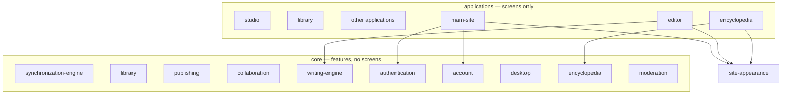

# Repository structure

Three folders. They expand. Everything else (server, documentation, hosting config) supports them.



Read this top to bottom, the same way the diagram is drawn: screens on top, the look in the middle, feature code underneath.

---

## 1. `site-appearance/` — the look (open this first)

The one look. Colors, the many gradient themes, fonts, page backgrounds, display type. Same name as Settings → Appearance.

Every current and future application boots this. Features never pick their own colors. This folder never imports `core/`.

```
site-appearance/
  documentation/  map — STRUCTURE, CONVENTIONS, ARCHITECTURE, DOMAIN
  tokens/
  css-styles/     theme.css, gradient-themes/, typography.css
  boot.js         and the rest of the theme runtime
  fonts/
  components/     later — shared chrome
```

**Skin contract** (every application page except the marketing homepage, which skips gradient theme on purpose):

1. `/site-appearance/css-styles/theme.css`
2. `/site-appearance/css-styles/gradient-themes/index.css`
3. `/site-appearance/css-styles/typography.css`
4. `/site-appearance/boot.js` (no defer)

Settings on main-site is the **picker**. Every other application only **applies** what was saved.

---

## 2. `applications/` — screens only

HTML plus thin glue. They import `site-appearance/` for look and `core/` for behavior. Applications never import other applications.

An application is a product surface a person uses. Staff tools are not applications.

```
applications/
  main-site/             live — landing, login, signup, settings, legal
  studio/                later — writer hub
  editor/                later — offline writing
  library/               later — browse / read / authors
  encyclopedia/          later — World Encyclopedia UI
  collaboration-rooms/   later
  plot-studio/           reserved Vite app
  community/             later
  analysis/              later
  archive/               retired screens — live code never imports this
```

`main-site/` is isolated. It is not the house. Layout: `pages/`, one folder per big page (`homepage/`, `login/`, `signup/`, `settings/`) with that page’s `*-css/` and JS, plus shared `page-ui/`, `pages-css/`, `assets/`, `public/`.

Public URLs did not change (`/login.html`, `/settings.html`). `/js/` and `/css/` still work; they rewrite into the page folders or shared `page-ui/` / `pages-css/`.

---

## 3. `core/` — features, no screens

What the product *is*. No HTML, CSS, or `document`. Never imports `site-appearance/` or `applications/`.

```
core/
  writing-engine/            manuscript: chapters, versions, word count
  synchronization-engine/    local-adapter now; realtime + conflict later
  authentication/            sign-in, session, logout, delete account
  account/                   who the user is: mode, profile, login streak
  desktop/                   desktop shell vs local guest
  library/                   public catalog, author profiles
  publishing/                serialization, scheduled releases
  encyclopedia/              story bible blobs — not chapter prose
  collaboration/             beta rooms now; live rooms later
  community/                 later
  analysis/                  later
  notifications/             later
  moderation/                later — staff / reports (not an application)
  tests/                     engine tests later
  server/                    HTTP, jobs, SQL — browsers never load this
```

Same name under `applications/` and `core/` means screen vs data (example: `applications/encyclopedia/` is the shelf UI, `core/encyclopedia/` is the blob store).

---

## File tree at the repo root

You should see **three product folders**, then `hosting/` for deploy contracts:

```
applications/
core/
site-appearance/
hosting/
```

`api/` is not a product folder. Vercel will only run functions from a root `api/` directory; it re-exports `core/server/http-handlers/`.

Git, Vercel, and Firebase also require a few **non-secret** files at the git root (they will not look inside `hosting/`): `.gitignore`, `.gitattributes`, `vercel.json`, `firebase.json`, `.firebaserc`, and a one-line `middleware.js` that re-exports `hosting/middleware.js`. See [hosting/README.md](../../hosting/README.md).

Local preview: `python3 core/server/dev.py`

See [CONVENTIONS.md](CONVENTIONS.md), [ARCHITECTURE.md](ARCHITECTURE.md), [DOMAIN.md](DOMAIN.md).
